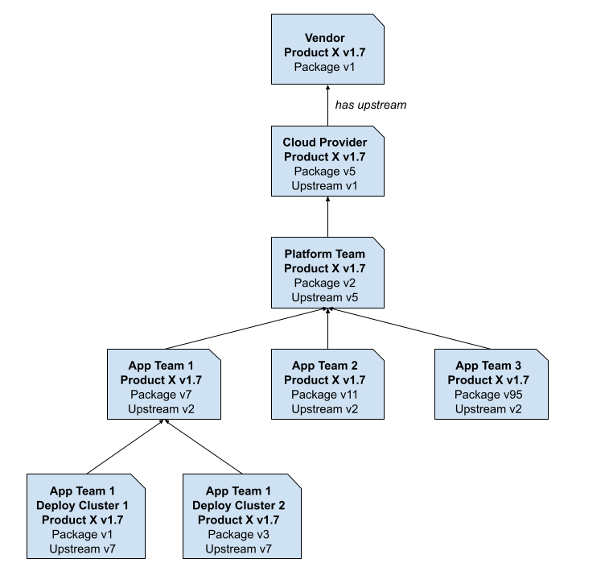
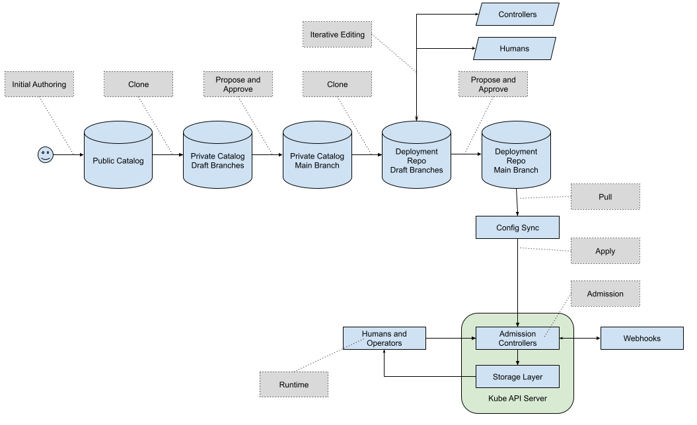

# Concepts

## Custom Resources and Controllers

A *Custom Resource Definition* or *CRD* is a Kubernetes extension mechanism for
adding custom data types to Kubernetes. The CRDs are the schemas - analogous to
table definitions in a relational database for example. The instances of those -
analogous to rows in a RDBMS - are called *Custom Resources* or *CRs*. People
often accidentally say "CRDs" when they mean "CRs", so be sure to ask for
clarification if the context doesn't make it clear which is meant.

In Kubernetes, resources - built-in ones as well as CRs - are processed by
*controllers*. A controller *actuates* the resource. For example, K8s
actuates a Service with Type LoadBalancer by creating a cloud provider
load balancer instance. Since Kubernetes is *declarative*, it doesn't just
actuate once. Instead, it actively reconciles the intent declared in the
resource, with the actual state of the managed entity. If the state of the
entity changes (a Pod is destroyed), Kubernetes will modify or recreate the
entity to match the desired state. And of course if the intended state changes,
Kubernetes will actuate the new intention. Speaking precisely, a *controller*
manages one or a few very closely related types of resources.
A *controller manager* is single binary that embeds multiple controllers, and an
*operator* is a set of these that manages a particular type of workload.
Speaking loosely, *controller* and *operator* are often used interchangeably,
though an *operator* always refers to code managing CRs rather than Kubernetes
built-in types.

All Kubernetes resources have a *metadata* field that contains the name,
namespace (if not cluster scoped), annotations and labels for the resource. Most
resources also have a *spec* and a *status* field. The *spec* field holds the
intended state, and the *status* field holds the observed state and any control
data needed by the controller to do its job. Typically, controllers read the
spec and write the status.

## Packages

*Packages* or *Kpt Packages* are bundles of Kubernetes resource files, along
with a Kptfile (also in Kubernetes Resource Model or KRM format). They provide
the basic unit of management in the Kpt toolchain. This toolchain is used to
manage the configuration before it reaches the Kubernetes API server. This
"shift left" model is critical to allowing **safe** collaborative, automated
configuration creation and editing, because errors or partial configurations can
be resolved prior to affecting operations.

Following the configuration-as-data principle, the package is not encapsulated.
Since the contents of the package is simply KRM resources, independently
designed tools and automation can operate on those resources. Instead of an
encapsulated abstract interface where inputs are provided and manifests are
rendered, we have an open concept we refer to as "the package is the
interface".

In order to allow multiple actors to operate on that open package safely, we
mediate the process via an API layer called *Porch* (for "**P**ackage
**Orch**estration). Porch provides a Kubernetes API for manipulating packages,
their contents, and how they map to repositories (which may be Git or OCI
repositories).

In Porch, packages always live within a repository. A package may have many
*package revisions*, or versions of the package, within the same repository. A
*draft* package revision lives in a draft branch, not in the main branch. When a
draft is ready to be used, it may be *proposed* for publication. If the proposed
draft is *approved* it becomes a *published* revision, and is assigned a
revision number by Porch. Published packages are tagged in the underlying
repository. A given package can have many revisions, but they are all
sequentially ordered as "v1", "v2", "v3", etc. This version is the revision
number of the configuration package, not the underlying software contained in
the package. This simple sequential numbering makes it easier to do automatic
discovery of configuration package updates.

There are a few different techniques we have for manipulating the content of
packages. The simplest and most basic is to just edit the files. Since the
"package is the interface", it is perfectly fine to simply edit files within
the package directly, and save them. The fact that the package is all KRM data
makes it relatively easy to merge upstream changes with downstream changes.

The next simplest is with *KRM functions*, also known as *kpt functions*. This
are small pieces of reusable code that perform a single purpose in manipulating
the configuration. When executed, a KRM function typically is provided with all
of the resources in the package, and modifies them however it needs to, and then
emits the updated list as output. A KRM function can be called *imperatively*,
by simply executing it against the package. This can be used, for example, with
the `search-and-replace` function to do a one-time change across many resources
in a package. Or, a KRM function can be setup in the Kptfile to be called
*declaratively*; it will be called every time Porch saves the package. This is
useful for functions that want to make sure information is consistent across
several resources within a package. For example, the `set-namespace` function
can be used to ensure the namespace is set correctly across all resources in a
package, even if a new resource is added later.

Functions are intended to be simple, and *hermetic*. This means they do not
reach out to other systems to gather information. They do not have network
access nor can they mount volumes. Instead, they simply take the inputs provided
in the package resources, and modify or generate other resources based on those.

Sometimes in order to create a re-usable function, that function will need
inputs. For simpler functions, inputs are captured via `ConfigMap` resources
within the Kptfile directly. For more complex function inputs, a
function-specific custom resource can be used. These resources though only live
within the package; we do not want them actually pushed to the cluster when we
deploy the package. To avoid that, we add a special annotation on the resources,
`config.kubernetes.io/local-config: "true"`. We thus often refer to these types
of resources as "local config" resources.

Stepping up the power and complexity level, the fact that Porch is a Kubernetes
API service means that we can build Kubernetes controllers on top of it. This is
exactly what we are doing in Nephio. The *Package Deployment Controller* is a
controller that takes a specific package along with a cluster selector, and
creates individual downstream versions of the package, customized for each
cluster. We often refer to this process of creating many downstream package
variants from a single upstream package as "fan out".

The actual method of creating those customizations on a per-cluster basis is
done via something we call *config injection*. This means that the package
expects some information to come from outside the package, based upon the
context where the package is being deployed. To make this work, the package
needs to "advertise" the configuration injection points. We do this with
"local config" resources. A package can contain a stub or placeholder resource,
which can be tagged with the annotation `automation.nephio.org/config-injection:
"true"`. This indicates that the package expects that a controller or other user
may want to replace the *spec* of the resource with some other data.

When the package deployment controller runs, it does a very simple injection
during the downstream package creation process. It looks through the package
resources for any injection points. For each one it finds, it looks for a
corresponding resource in the management cluster with the group, version, and
kind of the in-package resource, but the name of the target cluster. If it finds
one, it copies (*injects*) the spec from the in-cluster resource into the
in-package resource. For example, if the package contains a `ClusterContext`
resource with spec that includes a placeholder `SiteCode` value, the package
deployment controller will replace that spec with the one specific to the target
cluster, thereby making the cluster-specific `SiteCode` accessible to any KRM
functions that run within the package.

As an observer, you need to know whether or not this injection was successful,
because until we know all the injections are done, we do not know if the package
is fully ready for deployment. To facilitate this, the package deployment
controller creates a *package status condition* for each injection point. Status
conditions are used within Kubernetes to allow multiple controllers to interact
with a resource independently; we have modeled *package* status conditions after
this.

These conditions are also how *other* controllers know whether to modify a
package or not. Other controllers watch for draft package revisions that have
specific types of conditions set to "false". When they find a type of condition
they manage, they will execute their logic and inject the result into the
package. This is the means by which multiple actors can coordinate in modifying
a package, without interfering with one another.

### Package Ancestry

A package may have a single *upstream* parent, and many *downstream*
descendants. The Kptfiles in these packages are used to maintain the
relationships, capturing ancestry relationships like those shown below.

By tracking these relationships, changes at the original source can be
propagated via controlled automation down the tree.

### Package Configuration Journey

