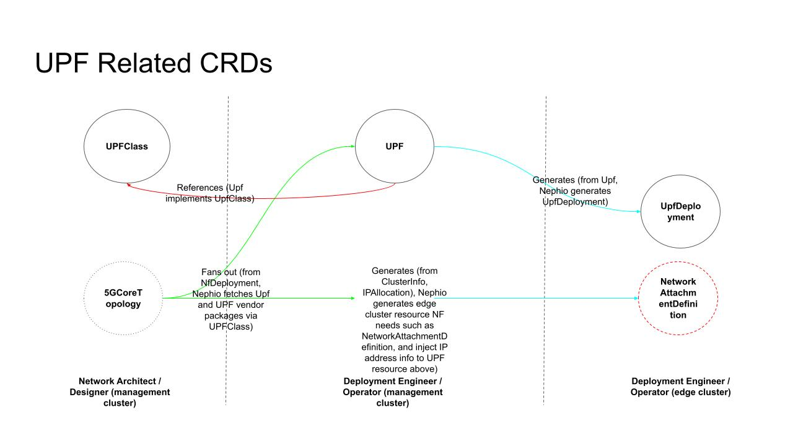
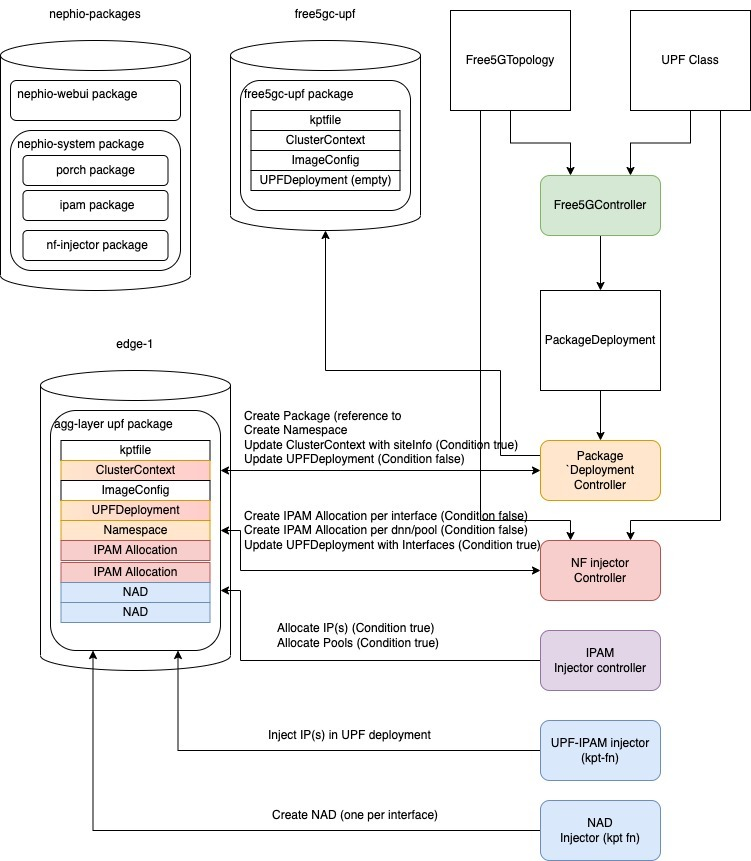

# Exercise

The environment you start with is a "blank slate". It has all the components of
the Nephio PoC installed, but does not have network functions and operators
installed.

Today, we will see two different ways of managing workloads in a Nephio-based
platform. The first will follow a traditional "operator" model. In this model,
we run an operator on the edge clusters, which processes a CR specific to that
operator. In doing so, it creates the Kubernetes resources needed to run that
workload. The second is a "shift left" model, in which the Kubernetes resources
needed to run the workload are generated on the management cluster, in the
configuration storage, without any need to run an operator on the workload
cluster. Both of these are valid and have their pros and cons, and both will be
needed in a real world deployment.

For the operator model example, we will use the free5gc UPF. For the shift-left
model, we will use a caching DNS instance. We had intended to use the SMF and a
future version of this workshop will do so, but unfortunately it is not
available yet.

The following diagram depicts the relationship of the CRDs used in this exercise:



Starting with the UPF journey, here is what you will do:

1. [Create an organizational version of the free5gc operator package](#create-an-organizational-version-of-the-free5gc-operator-package)
2. [Deploy that package across the edge clusters](#deploy-the-free5gc-operator)
3. [Configure a `FiveGCoreTopology` resource that contains the UPF configuration that is invariant across the set of clusters.](#deploy-a-fivegcoretopology)
4. Observe how the system interacts to fully fill out the configuration,
   constructing the `UPFDeployment` custom resource.
5. Publish the package so that the `UPFDeployment` gets delivered to the edge
   clusters.
6. Observe how the free5gc operator running in the edge cluster picks up the
   `UPFDeployment` and uses it to render a `ConfigMap` and `Deployment`
   resource, thus running the free5gc UPF.

## Create an Organizational Version of the free5gc Operator Package

Part of the idea of Nephio is to help manage the relationship between vendor,
organizational, team, and individual deployment variants of each package.

Let's create our own organizational variant of the upstream free5gc package,
using the Web UI.

* From the **Dashboard**, choose the *catalog* link under **Organizational
Blueprints**. This represents the private catalog of packages that have been
customized for your organization.
* In the resulting screen, push the **ADD ORGANIZATIONAL BLUEPRINT** button.
* In the **Add Organizational Blueprint** screen:
  * Choose "Create a new organizational blueprint by cloning an external
    blueprint".
  * Choose "free5gc-packages".
  * Choose "free5gc-operator".
  * Click Next
  * Click Next in the Metadata section.
  * Click Next in the Namespace section.
  * Click Next in the Validate Resources section.
  * Click the **CREATE ORGANIZATIONAL BLUEPRINT** button.
* The next screen is the package editor, for the new, *Draft* package you have
  just created. In order to make it available for deployment, we need to publish
  it.
  * Click the **PROPOSE** button.
  * It will change to **APPROVE** momentarily. Click that button.
  * Note: there is an occasional issue where you will see an "Internal error".
    This is a known bug. Just refresh the page and try again.
* You can click back on the *Package Management* link to go back to the
  **Dashboard**, where you will see your new package is available as an
  organizational blueprint.

## Deploy the free5gc Operator

We can use a `PackageDeployment` resource to create a multi-cluster deployment
across all edge clusters of our customized `free5gc-operator` package.

We have UI screen to do this.

* From the **Dashboard**, click the **MANAGE PACKAGES ACROSS CLUSTERS** button.
* Click the **ADD PACKAGE DEPLOYMENT** button.
* Choose "Deploy a organizational blueprint across a number of clusters".
* Choose "catalog" for the *Source Organizational Blueprint Repository*.
* Choose "free5gc-operator" for the *Package Reference*.
* Click Next
* Choose "us-central1" for the *Region*.
* Leave *Site* blank.
* Choose "edge" for the *Site Type*.
* Click Next
* Click Next in the Metadata section
* Click the **CREATE PACKAGE DEPLOYMENT** button.

After a few minutes, you should see the package in Draft form on each edge
cluster. For each of these, click on the package to go to the package editor
screen, **PROPOSE** and **APPROVE** to push the actual packages to the edge
clusters.

## Deploy a `FiveGCoreTopology`

The edge clusters are now ready to receive `UPFDeployment` resources that can be
used to run the UPF workloads.

Rather than manually creating those, we are going to use another controlling
resources, called a `FiveGCoreTopology` resource. The idea of this resource
(which is incomplete at this time), is that it represents configurations of your
5G Core Network functions in a cluster-neutral way, as well as how those
functions interrelate, and a selector for the clusters that should run that
function configuration.  Right now, only the UPF portion is working.

```bash
kubectl apply -f scripts/resources/FiveGCoreTopology.yml --context kind-nephio
```

What does the system do with this resource?

1. It generates a `PackageDeployment` resource to fan out the
   `free5gc-upf` package across the edge clusters, by following the
   *upfClassName* to the "free5gc-upf" `UPFClass`, which in turn contains a
   package reference.
2. That package includes two "local config" objects, one for the
   `ClusterContext` and one for the `UPFDeployment` itself.
3. The package deployment controller will inject the `ClusterContext`, which you
   can see in the *Conditions* tab of a free5gc-upf package instantiated by this
   process.
4. The `UPFDeployment` cannot be injected by the package deployment controller,
   but instead needs another controller, the [*nf injector controller*][1] to create
   it. That controller will see the `false` condition of the
   `UPFDeployment` condition type, and it will use the UPF configuration
   information from the `FiveGCoreTopology` resource, along with information
   from the injected `ClusterContext`, to generate the skeleton of
   the `UPFDeployment`. However, it doesn't know how to allocate IP addresses.
   Instead, it will generate new, local config resources of type
   `IPAMAllocation`, and associated package conditions set to `false`.
5. The *IPAM injector* will see these new package conditions, and will use the
   information in them to request IP addresses from the [*IPAM controller*][2],
   storing those IPs back into the *status* field of the `IPAMAllocation`.
6. A kpt function, [*nephio-upd-ipam-fn*][3], that is included in the *Kptfile*'s
   pipeline, will copy the IP addresses from the *status* to the right places in
   the `UPFDeployment`.
7. Another kpt function, [*nad-inject-fn*][4], will generate the Multus
   `NetworkAttachmentDefinition` resources using information from the
   `IPAMAllocation` resources.

The diagram below shows this interaction.



You can observe this by watching how the package automatically progresses
through conditions. You will need to refresh your browser page on the package
editor screen for the `agg-layer-upf` deployment.

Once all the conditions go green, you can **PROPOSE** and **APPROVE** the
package, delivering the completed `UPFDeployment` to the edge cluster. Then, you
can check to see that the `UPFDeployment` is delivered to the edge cluster, and
that the operator has created the associated `ConfigMap` and `Deployment`:

```bash
kubectl get deploy,cm,network-attachment-definition,upfdeployment,po --namespace upf --context kind-edge-1
```

[1]: https://github.com/henderiw-nephio/nf-injector-controller
[2]: https://github.com/henderiw-nephio/ipam
[3]: https://github.com/henderiw-kpt/nephio-upf-ipam-fn
[4]: https://github.com/henderiw-nephio/nad-inject-fn
